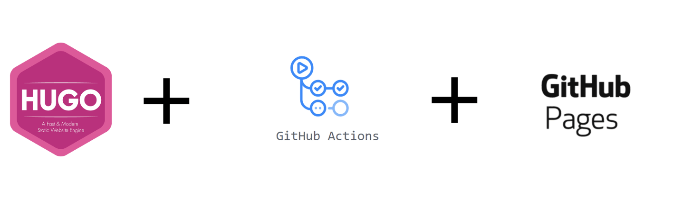

# Hugo-GitHub Pages Template Project

Template project for setting up a Hugo based static online portal and hosted on GitHub pages.

## Concept
- [Hugo](https://gohugo.io/): Hugo is one of the most popular open-source static website generators. With its amazing speed and flexibility, Hugo makes building websites fun again.

    - Hugo Installation:
    ```bash
        #macos
        brew install hugo

        #windows
        choco install hugo -confirm

        #linux
        snap install hugo
    ```

- [GitHub Actions](https://github.com/features/actions): GitHub Actions makes it easy to automate all your software workflows, now with world-class CI/CD. Build, test, and deploy your code right from GitHub. Make code reviews, branch management, and issue triaging work the way you want.

- [GitHub Pages](https://pages.github.com/): GitHub Pages is a static site hosting service that takes HTML, CSS, and JavaScript files straight from a repository on GitHub, optionally runs the files through a build process, and publishes a website.
 
    - Can host site on GitHub's `github.io` domain or your own custom domain.

## Prerequisite (only one)
**If want to publish website on custom domain(DNS), purchase your domain on some domain registrar like Namecheap.**

## Hugo Themes
*Complete list*: https://themes.gohugo.io/

## Related concepts
- [GitHub Template Project](https://help.github.com/en/github/creating-cloning-and-archiving-repositories/creating-a-template-repository): an existing repository a template, so you and others can generate new repositories with the same directory structure, branches, and files.

- [DNS](https://en.wikipedia.org/wiki/Domain_Name_System): The **Domain Name System (DNS)** is the phonebook of the Internet. Humans access information online through domain names, like sparscode.io. Web browsers interact through Internet Protocol (IP) addresses. DNS translates domain names to IP addresses so browsers can load Internet resources.

- [Static Website](https://en.wikipedia.org/wiki/Static_web_page): A static website contains Web pages with fixed content. Each page is coded in HTML and displays the same information to every visitor. Static sites are the most basic type of website and are the easiest to create. Unlike dynamic websites, they do not require any Web programming or database design.

- [TOML](https://github.com/toml-lang/toml): **Tom's Obvious, Minimal Language.** TOML aims to be a minimal configuration file format that's easy to read due to obvious semantics. TOML is designed to map unambiguously to a hash table. TOML should be easy to parse into data structures in a wide variety of languages.
